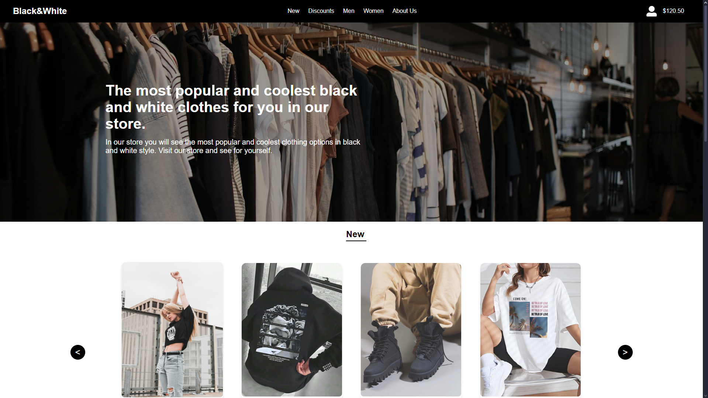

# Black & White Demo Store

This project is a non-commercial e-commerce demo designed to showcase front-end development skills. The concept is based on a black-and-white clothing store with a sleek, modern design.

## 🌟 Features

- **Responsive Design**: Works seamlessly on desktop and mobile devices.
- **Dynamic Product Sliders**: "New" and "Discounts" sections with interactive carousels.
- **Reusable Components**: Modular approach for easy maintenance and scalability.
- **State Management**: Centralized application state with Redux Toolkit or Context API.
- **Mock API (Optional)**: Data-driven UI powered by a simulated backend.

---

## 🖼️ Screenshots

### Homepage



---

## 👨‍💻 Designer

The design concept was created by [Sokyrskyi Denys](https://sokirskiydenis99.artstation.com). Check out their portfolio for more amazing designs!

---

## 🛠️ Technologies Used

- **Frontend**: React, TypeScript, Styled Components.
- **Navigation**: React Router for routing.
- **State Management**: Redux Toolkit (or React Context).
- **UI Elements**: Swiper.js for interactive sliders.
- **API Handling**: Axios for mock API integration.
- **Testing**: Jest and React Testing Library for unit testing.

---

## 🚀 Getting Started

Follow these steps to run the project locally:

1. Clone the repository:
   ```bash
   git clone https://github.com/id21x3/black-and-white-demo-store.git
   ```

2. Navigate to the project directory:
   ```bash
   cd black-and-white-demo-store
   ```

3. Install dependencies:
   ```bash
   npm install
   ```

4. Start the development server:
   ```bash
   npm run dev
   ```

5. Open your browser and navigate to:
   ```
   http://localhost:3000
   ```

---

## 🗂️ Project Structure

```
black-and-white/
├── public/             # Static files (HTML, images, fonts)
├── src/                # Application source code
│   ├── components/     # Reusable UI components
│   │   ├── Header/
│   │   ├── Footer/
│   │   ├── Slider/
│   │   ├── ProductCard/
│   │   └── InfoSection/
│   ├── pages/          # Main application pages
│   ├── redux/          # State management (slices, store)
│   ├── styles/         # Global and reusable styles
│   ├── utils/          # Helper functions
│   ├── App.tsx         # Root application component
│   ├── index.tsx       # Entry point
│   └── types/          # TypeScript types
├── package.json        # Project dependencies and scripts
├── tsconfig.json       # TypeScript configuration
└── README.md           # Project documentation
```

---

## 🎯 Future Enhancements

- **Product Filtering**: Allow users to sort by categories, price, and popularity.
- **Shopping Cart**: Add functionality for adding, removing, and updating cart items.
- **Authentication**: Integrate user login and registration.
- **Real API Integration**: Connect the frontend to a real backend.

---

## 🤝 Contributing

Contributions, issues, and feature requests are welcome! Feel free to open an issue or submit a pull request to improve the project.

---

## 📧 Contact

If you have any questions or suggestions, feel free to reach out at:
- **Email**: ihor.danchuk213@gmail.com
- **GitHub**: [id21x3](https://github.com/id21x3)
